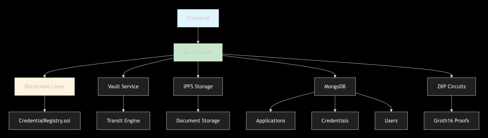
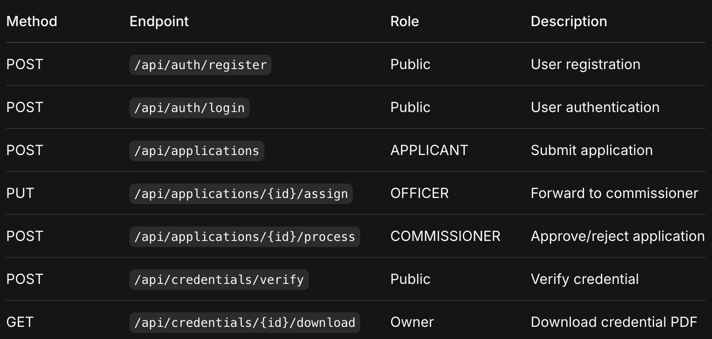

# Municipal Credentials Platform (MCP)

## 🌟 Overview

The **Municipal Credentials Platform (MCP)** is a comprehensive, privacy-preserving digital credentialing system that enables municipalities to issue, manage, and verify official documents using blockchain technology, Zero-Knowledge Proofs (ZKPs), and decentralized identity standards.

## 🚀 Key Features

- **🔐 Privacy-First Design**: Zero-Knowledge Proofs for selective disclosure of sensitive information
- **⛓️ Blockchain Anchored**: Immutable credential registration on Ethereum-compatible networks
- **🆔 Decentralized Identity**: W3C-compliant Verifiable Credentials with DIDs
- **🔐 Secure Signing**: HashiCorp Vault integration for cryptographic operations
- **💾 Decentralized Storage**: IPFS for credential document storage
- **📱 QR Verification**: Instant credential verification via QR codes
- **👥 Multi-Role Workflow**: Streamlined applicant → officer → commissioner workflow

## 🏗️ System Architecture


-[Minimal Data Flow Diagram](https://drive.google.com/file/d/1neVPEi45hvD72-W9i8aZ9fXsvX5mRNg3/view?usp=sharing)

## 📁 Project Structure

```
mcp/
├── 📁 blockchain/
│   ├── contracts/CredentialRegistry.sol
│   ├── scripts/deploy.js
│   └── hardhat.config.js
├── 📁 backend/
│   ├── controllers/
│   ├── models/
│   ├── middleware/
│   ├── services/
│   ├── routes/
│   └── utils/
├── 📁 circuits/
│   ├── ApplicationZKP.circom
│   └── build/
└── 📁 frontend/
    ├── src/
    └── public/

```

## 🛠️ Technology Stack

### Core Technologies
- **Backend**: Node.js, Express.js, MongoDB
- **Blockchain**: Solidity, Hardhat, Ethers.js
- **Cryptography**: Circom, SnarkJS, HashiCorp Vault
- **Storage**: IPFS, MongoDB
- **Identity**: W3C DIDs, JWT, Verifiable Credentials

### Security & Privacy
- **Zero-Knowledge Proofs**: Groth16 zk-SNARKs
- **Cryptographic Signing**: RSA-2048 via Vault Transit
- **Secure Storage**: Encrypted databases + IPFS
- **Access Control**: Role-based permissions

## ⚙️ Installation & Setup

### Prerequisites

- Node.js 18+
- MongoDB 6.0+
- HashiCorp Vault 1.14+
- IPFS node
- Hardhat development environment

### 1. Clone Repository

```bash
git clone https://github.com/ishangawande55/MCP
cd mcp
```

### 2. Backend Setup

```bash
cd backend
npm install

# Copy environment configuration
cp .env.example .env

# Update .env with your configuration
```

### 3. Blockchain Setup

```bash
cd blockchain
npm install

# Deploy contracts
npx hardhat compile
npx hardhat run scripts/deploy.js --network localhost
```

### 4. Vault Setup

```bash
cd deployment
docker-compose up -d vault01 vault02 vault03

# Initialize and unseal Vault
./scripts/init-vault.sh
```

### 5. IPFS Setup

```bash
ipfs init
ipfs daemon
```

## 🔧 Configuration

### Environment Variables

Create `.env` file with the following configuration:

```env
# Server
PORT=8000
NODE_ENV=development

# Database
MONGODB_URI=mongodb://localhost:27017/mcp

# Vault
VAULT_ADDR=http://127.0.0.1:8200
VAULT_ROOT_TOKEN=your_root_token

# Blockchain
BLOCKCHAIN_RPC_URL=http://127.0.0.1:8545
CONTRACT_ADDRESS=0x5FbDB2315678afecb367f032d93F642f64180aa3

# JWT
JWT_SECRET=your_jwt_secret
JWT_EXPIRES_IN=7d

# IPFS
IPFS_API_URL=http://127.0.0.1:5001
IPFS_GATEWAY_URL=https://ipfs.io/ipfs
```

### Commissioner Key Setup

Configure commissioner blockchain addresses and private keys:

```env
ADMIN_PRIVATE_KEY=0xac0974bec39a17e36ba4a6b4d238ff944bacb478cbed5efcae784d7bf4f2ff80
HEALTHCARE_COMMISSIONER_PRIVATE_KEY=0x59c6995e998f97a5a0044966f0945389dc9e86dae88c7a8412f4603b6b78690d
LICENSES_COMMISSIONER_PRIVATE_KEY=0x5de4111afa1a4b94908f83103eb1f1706367c2e68ca870fc3fb9a804cdab365a
```

## 🚀 Usage Guide

### 1. User Registration

**Register as Applicant:**
```javascript
POST /api/auth/register
{
  "name": "Rajesh Kumar",
  "email": "rajesh@example.com",
  "password": "securepassword",
  "role": "APPLICANT",
  "phone": "+91-9876543210",
  "address": "123 Main Street, Mumbai"
}
```

**Register as Commissioner:**
```javascript
POST /api/auth/register
{
  "name": "Commissioner Sharma",
  "email": "sharma@municipal.gov", 
  "password": "securepassword",
  "role": "COMMISSIONER",
  "department": "HEALTHCARE",
  "blockchainAddress": "0x..."
}
```

### 2. Application Submission

**Submit Birth Certificate Application:**
```javascript
POST /api/applications
{
  "type": "BIRTH",
  "birthDetails": {
    "childName": "Aarav Kumar",
    "dateOfBirth": "2023-05-15",
    "gender": "Male",
    "fatherName": "Rajesh Kumar"
  },
  "disclosedFields": ["childName", "dateOfBirth"],
  "supportingDocuments": [
    {
      "name": "hospital_certificate.pdf",
      "ipfsCID": "QmXyz..."
    }
  ]
}
```

### 3. Application Processing

**Officer Assignment:**
```javascript
PUT /api/applications/{id}/assign
// Officer forwards to commissioner
```

**Commissioner Approval:**
```javascript
POST /api/applications/{id}/process
{
  "action": "APPROVE",
  "reviewComments": "All documents verified"
}
```

### 4. Credential Verification

```javascript
POST /api/credentials/verify
{
  "credentialId": "cred-BIRTH-1640995200000-456"
}
```

## 🔐 Core Components

### Smart Contract: CredentialRegistry

```solidity
// Key functions:
- issueCertificate(): Register new credential
- verifyCertificate(): Check credential status  
- revokeCertificate(): Revoke credentials
- getCertificate(): Retrieve credential metadata
```

### Zero-Knowledge Proof Circuit

```circom
// ApplicationZKP.circom
// Supports selective disclosure for:
- Birth certificates
- Death certificates  
- Trade licenses
- NOC certificates
```

### Verifiable Credential Structure

```json
{
  "@context": ["https://www.w3.org/2018/credentials/v1"],
  "type": ["VerifiableCredential", "BIRTH_Credential"],
  "issuer": "did:mcp:commissioner:healthcare001",
  "issuanceDate": "2024-01-15T10:30:00Z",
  "credentialSubject": {
    "id": "did:mcp:applicant:rajesh123",
    "applicationId": "BIRTH-1640995200000-456",
    "details": {
      "childName": "Aarav Kumar",
      "dateOfBirth": "2023-05-15"
    }
  },
  "proof": {
    "type": "EcdsaSecp256k1Signature2019",
    "signatureValue": "..."
  }
}
```

## 🧪 Testing

### Run Test Suite

```bash
# Blockchain tests
cd blockchain
npx hardhat test

# Backend tests  
cd backend
npm test

# ZKP circuit tests
cd circuits
./scripts/test_circuit.sh
```

### Test Credential Flow

1. Register test users
2. Submit sample application
3. Process through workflow
4. Issue credential
5. Verify credential integrity

## 🔒 Security Features

### Privacy Protection
- **Selective Disclosure**: Reveal only necessary information
- **ZKPs**: Prove claims without revealing underlying data
- **DIDs**: Decentralized identifiers protect personal data
- **IPFS**: Encrypted document storage

### Cryptographic Security
- **Vault Transit**: HSM-backed signing operations
- **Bcrypt**: Secure password hashing
- **JWT**: Stateless authentication
- **Merkle Roots**: Blockchain integrity proofs

### Access Control
- **Role-Based Permissions**: APPLICANT, OFFICER, COMMISSIONER, ADMIN
- **Department Segregation**: Healthcare, License, NOC departments
- **Audit Logging**: Comprehensive activity tracking

## 📊 API Documentation

### Key Endpoints



### Response Format

```json
{
  "success": true,
  "message": "Operation completed successfully",
  "data": {
    // Response data
  }
}
```

## 🤝 Contributing

We welcome contributions! Please see our [Contributing Guide](CONTRIBUTING.md) for details.

### Development Setup

1. Fork the repository
2. Create feature branch: `git checkout -b feature/amazing-feature`
3. Commit changes: `git commit -m 'Add amazing feature'`
4. Push to branch: `git push origin feature/amazing-feature`
5. Open Pull Request

### Code Standards

- Follow ESLint configuration
- Write comprehensive tests
- Update documentation
- Use conventional commit messages

## 📄 License

This project is licensed under the ISC License - see the [LICENSE](LICENSE) file for details.

## 🆘 Support

### Documentation
- [API Documentation](docs/API.md)
- [Deployment Guide](docs/DEPLOYMENT.md)
- [Security Overview](docs/SECURITY.md)

### Community
- [Discord Channel](https://discord.gg/mcp)
- [GitHub Issues](https://github.com/your-org/mcp/issues)
- [Email Support](mailto:support@mcp.gov)

### Reporting Issues

When reporting issues, please include:
- MCP version
- Environment details
- Steps to reproduce
- Log files
- Expected vs actual behavior

## 🏛️ Governance

The Municipal Credentials Platform follows open governance principles with representation from:
- Municipal authorities
- Technical experts
- Community representatives
- Security auditors

---


*Municipal Credentials Platform v1.0.0 | [View on GitHub](https://github.com/ishangawande55/MCP)*