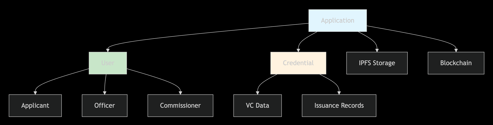

# Application Model Documentation

## 📋 Overview

The `Application` model defines the MongoDB schema for municipal credential applications (Birth, Death, Trade License, NOC) with comprehensive support for Zero-Knowledge Proofs (ZKP) and Selective Disclosure workflows. It manages the entire application lifecycle from submission to credential issuance.

## 🏗️ Schema Architecture


## 🎯 Key Features

- **📋 Multi-Type Support**: Birth, Death, Trade License, and NOC applications
- **🔐 ZKP Integration**: Full Zero-Knowledge Proof lifecycle management
- **🕵️ Selective Disclosure**: Granular field-level disclosure control
- **👥 Role-Based Workflow**: Officer and commissioner assignment tracking
- **📊 Comprehensive Audit**: Complete application history and timeline
- **💾 Document Management**: IPFS-based supporting document storage
- **🔗 Blockchain Ready**: Merkle root anchoring for verification

## 📊 Schema Structure

### Core Identifiers

```javascript
// ---------------------
// Core Identifiers
// ---------------------
applicationId: { type: String, required: true, unique: true },
credentialId: { type: String, ref: "Credential" },
type: {
  type: String,
  enum: ["BIRTH", "DEATH", "TRADE_LICENSE", "NOC"],
  required: true,
},
department: {
  type: String,
  enum: ["HEALTHCARE", "LICENSE", "NOC"],
  required: true,
},
```

### Applicant Details

```javascript
// ---------------------
// Applicant Details
// ---------------------
applicant: {
  userId: { type: mongoose.Schema.Types.ObjectId, ref: "User" },
  name: { type: String, required: true },
  email: { type: String, required: true },
  phone: { type: String, required: true },
  address: { type: String, required: true },
  did: { type: String, required: true }, // Decentralized Identifier
},
```

### Type-Specific Details


**Schema Implementation:**
```javascript
// ---------------------
// Type-specific Details
// ---------------------
birthDetails: {
  childName: String,
  dateOfBirth: Date,
  gender: String,
  placeOfBirth: String,
  fatherName: String,
  motherName: String,
},
deathDetails: {
  deceasedName: String,
  dateOfDeath: Date,
  placeOfDeath: String,
  causeOfDeath: String,
},
tradeDetails: {
  businessName: String,
  businessType: String,
  businessAddress: String,
  licenseDuration: Number,
},
nocDetails: {
  purpose: String,
  propertyAddress: String,
  applicantType: String,
},
```

## 🔐 Selective Disclosure System

### Disclosure Flags Structure

```javascript
// ---------------------
// Selective Disclosure Flags
// ---------------------
disclosedFlags: {
  birthDetails: {
    childName: { type: Number, default: 1 },
    dateOfBirth: { type: Number, default: 1 },
    gender: { type: Number, default: 1 },
    placeOfBirth: { type: Number, default: 1 },
    fatherName: { type: Number, default: 1 },
    motherName: { type: Number, default: 1 },
  },
  deathDetails: {
    deceasedName: { type: Number, default: 1 },
    dateOfDeath: { type: Number, default: 1 },
    placeOfDeath: { type: Number, default: 1 },
    causeOfDeath: { type: Number, default: 1 },
  },
  // ... similar for tradeDetails and nocDetails
},
disclosedFields: { type: [String], default: [] },
```

### Disclosure Workflow


## ⚙️ Workflow Management

### Status Lifecycle

```javascript
// ---------------------
// Workflow Status
// ---------------------
status: {
  type: String,
  enum: [
    "PENDING",
    "UNDER_REVIEW", 
    "FORWARDED_TO_COMMISSIONER",
    "APPROVED",
    "REJECTED",
    "ISSUED",
  ],
  default: "PENDING",
},
```

### Status Transition Flow


### Officer & Commissioner Assignment

```javascript
// ---------------------
// Officer & Commissioner Assignment
// ---------------------
assignedOfficer: { type: mongoose.Schema.Types.ObjectId, ref: "User" },
forwardedCommissioner: { type: mongoose.Schema.Types.ObjectId, ref: "User" },
forwardedCommissionerDID: { type: String },
forwardedCommissionerPublicKey: { type: String },
forwardedAt: { type: Date },
```

## 🔐 ZKP Integration

### Proof Lifecycle Management

```javascript
// ---------------------
// ZKP & Selective Disclosure Integration
// ---------------------
/**
 * Multiple ZKP proofs lifecycle:
 * - initialZkpProof: proof generated at submission
 * - intermediateZkpProof: optional intermediate proofs  
 * - finalZkpProof: final proof for issuance / selective disclosure
 * 
 * Public signals must match corresponding proofs.
 */
initialZkpProof: { type: Object, required: false },
intermediateZkpProof: { type: Object, required: false },
finalZkpProof: { type: Object, required: false },

initialPublicSignals: { type: [String], required: false },
intermediatePublicSignals: { type: [String], required: false },
finalPublicSignals: { type: [String], required: false },

merkleRoot: { type: String, required: false }, // Anchored root for blockchain verification
```

### ZKP Proof Workflow


## 📋 Supporting Documents

```javascript
// ---------------------
// Supporting Documents
// ---------------------
supportingDocuments: [
  { 
    name: String, 
    ipfsCID: String  // IPFS Content Identifier for document storage
  }
],
```

## 📊 Audit Trail & History

### History Schema

```javascript
// ---------------------
// Application History & Audit
// ---------------------
history: [
  {
    action: String,
    by: {
      id: { type: mongoose.Schema.Types.ObjectId, ref: "User" },
      name: String,
      role: String,
      did: String,
    },
    to: {
      id: { type: mongoose.Schema.Types.ObjectId, ref: "User" },
      name: String,
      did: String,
    },
    at: { type: Date, default: Date.now },
    note: String,
  },
],
```

### Sample History Entry

```javascript
{
  action: "FORWARDED_TO_COMMISSIONER",
  by: {
    id: "507f1f77bcf86cd799439011",
    name: "Officer Patel",
    role: "OFFICER",
    did: "did:mcp:officer123"
  },
  to: {
    id: "507f1f77bcf86cd799439012", 
    name: "Commissioner Sharma",
    did: "did:mcp:commissioner456"
  },
  at: "2024-01-15T10:30:00.000Z",
  note: "Forwarded BIRTH application to HEALTHCARE commissioner for approval"
}
```

## 💡 Usage Examples

### Creating a Birth Certificate Application

```javascript
const application = new Application({
  applicationId: "BIRTH-1640995200000-123",
  type: "BIRTH",
  department: "HEALTHCARE",
  applicant: {
    userId: "507f1f77bcf86cd799439011",
    name: "Rajesh Kumar",
    email: "rajesh@example.com",
    phone: "+91-9876543210",
    address: "123 Main Street, Mumbai",
    did: "did:mcp:applicant123"
  },
  birthDetails: {
    childName: "Aarav Kumar",
    dateOfBirth: new Date("2023-05-15"),
    gender: "Male",
    placeOfBirth: "Municipal Hospital, Delhi",
    fatherName: "Rajesh Kumar",
    motherName: "Priya Kumar"
  },
  disclosedFields: ["childName", "dateOfBirth", "gender"],
  supportingDocuments: [
    {
      name: "hospital_certificate.pdf",
      ipfsCID: "QmXyz123..."
    }
  ]
});

await application.save();
```

### Application with ZKP Proofs

```javascript
// After ZKP generation
application.initialZkpProof = zkpResult.proof;
application.initialPublicSignals = zkpResult.publicSignals;
application.merkleRoot = zkpResult.merkleRoot;
application.disclosedFields = ["childName", "dateOfBirth"]; // Only these fields disclosed

await application.save();
```

### Workflow Progression

```javascript
// Officer assignment
application.assignedOfficer = officerId;
application.status = "UNDER_REVIEW";
application.history.push({
  action: "ASSIGNED_TO_OFFICER",
  by: { id: adminId, name: "Admin User", role: "ADMIN" },
  at: new Date(),
  note: "Assigned to Officer Patel for verification"
});

// Commissioner forwarding
application.forwardedCommissioner = commissionerId;
application.forwardedCommissionerDID = commissioner.did;
application.forwardedCommissionerPublicKey = commissioner.publicKey;
application.status = "FORWARDED_TO_COMMISSIONER";
application.forwardedAt = new Date();

await application.save();
```

## 🔄 Integration Points

### Relationships with Other Models



### Indexing Recommendations

```javascript
// Recommended indexes for performance
applicationSchema.index({ applicationId: 1 }); // Unique lookup
applicationSchema.index({ "applicant.userId": 1 }); // User's applications
applicationSchema.index({ status: 1 }); // Status-based queries
applicationSchema.index({ type: 1, department: 1 }); // Department queries
applicationSchema.index({ assignedOfficer: 1 }); // Officer workload
applicationSchema.index({ forwardedCommissioner: 1 }); // Commissioner workload
applicationSchema.index({ createdAt: -1 }); // Recent applications
```

## 🛡️ Security Considerations

### Data Privacy

- **Selective Disclosure**: Only store what's necessary for verification
- **IPFS Integration**: Sensitive documents stored off-chain
- **DID Usage**: Decentralized identifiers instead of personal data
- **Field-Level Encryption**: Consider encrypting sensitive fields

### Audit Compliance

- **Immutable History**: All actions tracked with timestamps
- **Role-Based Access**: Clear attribution of actions to users
- **Comprehensive Logging**: Full lifecycle tracking for compliance

---

**Author**: Ishan Gawande  
**Version**: 1.0.0  
**Features**: ZKP integration, Selective disclosure, Workflow management  
**Security**: Privacy-preserving design, Audit trails  
**Integration**: MongoDB, IPFS, Blockchain, User models  
**License**: MIT