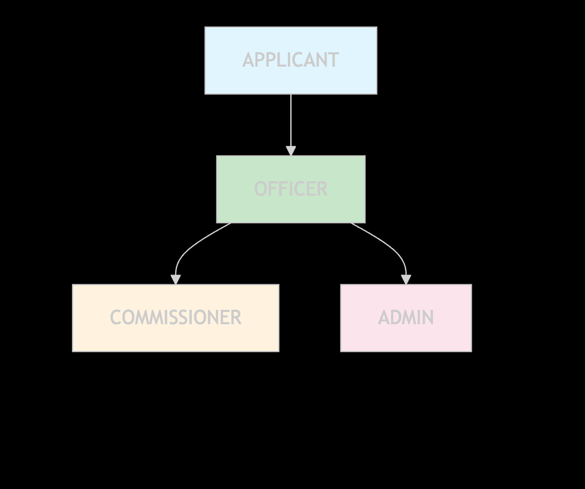
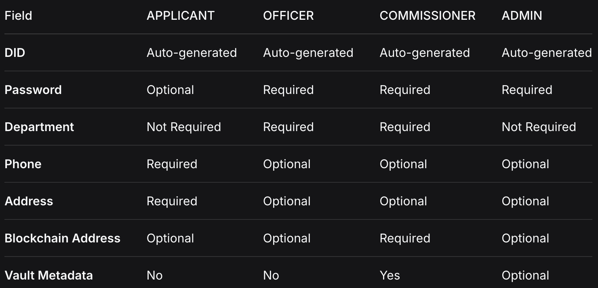

# User Model Documentation

## 📋 Overview

The `User` model defines the MongoDB schema for all users in the Municipal Credentials Platform, including Applicants, Officers, Commissioners, and Admins. It provides comprehensive identity management with Decentralized Identifiers (DIDs), role-based access control, and HashiCorp Vault integration for cryptographic operations.

## 🏗️ Schema Architecture


## 🎯 Key Features

- **🔐 Decentralized Identity**: Auto-generated DIDs for all users
- **👥 Multi-Role Support**: Applicants, Officers, Commissioners, Admins
- **🔑 Vault Integration**: Automated cryptographic key management
- **🏢 Department Assignment**: Role-based department mapping
- **🔒 Secure Authentication**: Bcrypt password hashing
- **⛓️ Blockchain Ready**: Ethereum address integration
- **📊 Active Management**: User activation/deactivation control

## 📊 Schema Structure

### Core Identity & Authentication

```javascript
did: {
  type: String,
  unique: true,
  default: function () {
    // Auto-generate DID for all users (applicants/officers/commissioners)
    return generateDID(this.role);
  }
},
publicKey: { type: String }, // optional, filled if DID has key

name: { type: String, required: true },
email: { type: String, required: true, unique: true },
password: {
  type: String,
  required: function () {
    return this.role !== 'APPLICANT'; 
  }
},
```

### Role & Department Management

```javascript
role: {
  type: String,
  enum: ['APPLICANT', 'OFFICER', 'COMMISSIONER', 'ADMIN'],
  default: 'APPLICANT'
},
department: {
  type: String,
  enum: ['HEALTHCARE', 'LICENSE', 'NOC'],
  required: function () {
    return this.role === 'OFFICER' || this.role === 'COMMISSIONER';
  }
},
```

### Contact Information

```javascript
phone: {
  type: String,
  required: function () {
    return this.role === 'APPLICANT';
  }
},
address: {
  type: String,
  required: function () {
    return this.role === 'APPLICANT';
  }
},
```

### Vault Integration

```javascript
// Vault automation metadata
vault: {
  keyName: { type: String },        // e.g., commissioner-key-u123
  policyName: { type: String },     // e.g., policy-commissioner-key-u123
  token: { type: String },          // Limited token for signing
  createdAt: { type: Date },        // Track when Vault key/policy created
  lastRotated: { type: Date }       // Optional future use (key rotation)
},
```

### System Fields

```javascript
blockchainAddress: { type: String },
isActive: { type: Boolean, default: true },
createdAt: { type: Date, default: Date.now }
```

## 🔐 Authentication & Security

### Password Hashing

```javascript
// Hash password before save
userSchema.pre('save', async function (next) {
  if (!this.isModified('password')) return next();
  if (this.password) this.password = await bcrypt.hash(this.password, 12);
  next();
});
```

### Password Comparison

```javascript
// Compare password for login
userSchema.methods.comparePassword = async function (candidatePassword) {
  if (!this.password) return false;
  return await bcrypt.compare(candidatePassword, this.password);
};
```

## 👥 Role-Based Requirements

### Role Hierarchy & Permissions



### Field Requirements by Role

|

## 🔐 Vault Integration Details

### Commissioner Vault Setup

```javascript
// Example Vault metadata for a commissioner
vault: {
  keyName: "commissioner-key-healthcare001",
  policyName: "policy-commissioner-key-healthcare001", 
  token: "hvs.CAESIBVt...", // Scoped Vault token
  createdAt: "2024-01-15T10:30:00.000Z",
  lastRotated: null
}
```

### Vault Key Lifecycle


## 💡 Usage Examples

### Creating an Applicant

```javascript
const applicant = new User({
  name: "Rajesh Kumar",
  email: "rajesh@example.com",
  role: "APPLICANT",
  phone: "+91-9876543210",
  address: "123 Main Street, Mumbai"
  // password is optional for applicants
  // DID is auto-generated
});

await applicant.save();
```

### Creating an Officer

```javascript
const officer = new User({
  name: "Officer Patel",
  email: "patel@municipal.gov",
  password: "securePassword123",
  role: "OFFICER",
  department: "LICENSE"
  // DID auto-generated
  // phone and address optional
});

await officer.save();
```

### Creating a Commissioner

```javascript
const commissioner = new User({
  name: "Commissioner Sharma", 
  email: "sharma@municipal.gov",
  password: "securePassword123",
  role: "COMMISSIONER",
  department: "HEALTHCARE",
  blockchainAddress: "0x742d35Cc6634C0532925a3b8bc1934eF04240000",
  // Vault metadata added after registration
});

// After Vault setup
commissioner.vault = {
  keyName: "commissioner-key-healthcare001",
  policyName: "policy-commissioner-key-healthcare001",
  token: "hvs.CAESIBVt...",
  createdAt: new Date()
};

await commissioner.save();
```

### Authentication Flow

```javascript
const user = await User.findOne({ email: "sharma@municipal.gov" });
if (user && await user.comparePassword("password123")) {
  // User authenticated successfully
  console.log("User DID:", user.did);
  console.log("User role:", user.role);
} else {
  // Authentication failed
}
```

## 🔄 Integration Points

### DID Generation Utility

```javascript
// Expected ../utils/didGenerator.js
function generateDID(role) {
  const uniqueId = crypto.randomBytes(8).toString('hex');
  const method = role.toLowerCase();
  return `did:mcp:${method}:${uniqueId}`;
}

module.exports = { generateDID };
```

### Expected DID Formats

- **Applicant**: `did:mcp:applicant:a1b2c3d4e5f6`
- **Officer**: `did:mcp:officer:b2c3d4e5f6g7` 
- **Commissioner**: `did:mcp:commissioner:c3d4e5f6g7h8`
- **Admin**: `did:mcp:admin:d4e5f6g7h8i9`

### Department Mapping

```javascript
// Department to application type mapping
const DEPARTMENT_APPLICATIONS = {
  HEALTHCARE: ['BIRTH', 'DEATH'],
  LICENSE: ['TRADE_LICENSE'], 
  NOC: ['NOC']
};
```

## 📈 Indexing Recommendations

```javascript
// Recommended indexes for optimal performance
userSchema.index({ email: 1 });                    // Unique email lookup
userSchema.index({ did: 1 });                      // DID-based queries
userSchema.index({ role: 1 });                     // Role-based filtering
userSchema.index({ department: 1 });               // Department queries
userSchema.index({ isActive: 1 });                 // Active user queries
userSchema.index({ "vault.keyName": 1 });          // Vault key lookups
userSchema.index({ createdAt: -1 });               // Recent users
userSchema.index({ role: 1, department: 1 });      // Combined role/dept queries
```

## 🛡️ Security Considerations

### Password Security

- **Bcrypt Strength**: 12 rounds for strong hashing
- **Optional for Applicants**: Some applicants may use external auth
- **No Plain Text**: Passwords never stored in plain text
- **Modification Check**: Only hash when password actually changes

### Vault Token Security

- **Scoped Tokens**: Limited permissions for specific keys
- **Secure Storage**: Tokens stored in database with application-level security
- **Rotation Planning**: `lastRotated` field for future key rotation
- **No Private Keys**: Private keys never leave Vault

### DID Security

- **Auto-Generation**: Consistent DID generation prevents conflicts
- **Role-Based Prefixing**: Clear identification of user types
- **Unique Constraints**: Database-level uniqueness enforcement

## 🚀 Advanced Features

### Method Extensions

```javascript
// Additional useful methods
userSchema.methods.isCommissioner = function() {
  return this.role === 'COMMISSIONER';
};

userSchema.methods.hasVaultAccess = function() {
  return !!(this.vault && this.vault.keyName && this.vault.token);
};

userSchema.methods.getVerificationMethods = function() {
  const methods = [];
  if (this.publicKey) methods.push({ type: 'EcdsaSecp256k1VerificationKey2019', publicKey: this.publicKey });
  if (this.hasVaultAccess()) methods.push({ type: 'VaultSigningKey', keyName: this.vault.keyName });
  return methods;
};
```

### Virtual Fields

```javascript
// Virtual fields for derived properties
userSchema.virtual('isStaff').get(function() {
  return ['OFFICER', 'COMMISSIONER', 'ADMIN'].includes(this.role);
});

userSchema.virtual('canIssueCredentials').get(function() {
  return this.role === 'COMMISSIONER' && this.hasVaultAccess();
});
```

---

**Author**: Ishan Gawande  
**Version**: 1.0.0  
**Security**: Bcrypt hashing, Vault integration, DID identity  
**Features**: Multi-role support, department management, blockchain readiness  
**Integration**: MongoDB, HashiCorp Vault, Blockchain, Authentication  
**License**: MIT