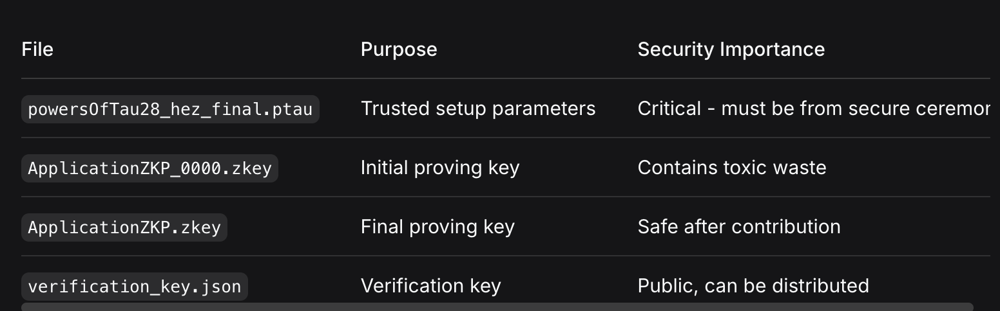

# ZKP Circuit Build & Key Generation Documentation

## 📋 Overview

This documentation covers the complete build pipeline for the ApplicationZKP Zero-Knowledge Proof circuit, including compilation, trusted setup, and key generation. The scripts automate the process of transforming Circom code into provable and verifiable ZKP artifacts.

## 🏗️ Build Pipeline Architecture


## 📁 File Structure

```
zkp/
├── scripts/
│   ├── compile_circuit.sh          # Circuit compilation
│   ├── generate_keys.sh            # Trusted setup & key generation
│   └── generate_witness.sh         # Witness computation
├── circuits/
│   ├── ApplicationZKP.circom       # Main circuit
│   └── lib/
│       ├── circomlib/              # Circom standard library
│       └── poseidon.circom         # Poseidon hash implementation
├── build/
│   └── ApplicationZKP/
│       ├── ApplicationZKP.r1cs     # Constraint system
│       ├── ApplicationZKP.wasm     # WebAssembly circuit
│       ├── ApplicationZKP.zkey     # Proving key
│       └── verification_key.json   # Verification key
├── setup/
│   └── powersOfTau28_hez_final.ptau # Trusted setup parameters
└── inputs/
    └── sampleInput.json            # Sample circuit inputs
```

## 🔧 Script Details

### 1. Circuit Compilation Script

```bash
#!/bin/bash

CIRCUIT_NAME="ApplicationZKP"
CIRCUIT_DIR="../circuits"
BUILD_DIR="$(pwd)/../build/${CIRCUIT_NAME}"
INCLUDE_DIR="$(pwd)/../circuits/lib/circomlib"   # folder containing poseidon.circom
CONSTANTS_DIR="$(pwd)/../circuits/lib"           # folder containing poseidon_constants.circom

echo "🚀 Starting compilation for circuit: ${CIRCUIT_NAME}"
mkdir -p ${BUILD_DIR}

# Circom 2.x only allows one -l at a time, so use the folder with poseidon.circom as the include
circom ${CIRCUIT_DIR}/${CIRCUIT_NAME}.circom \
  --r1cs --wasm --sym \
  -l ${INCLUDE_DIR} \
  -o ${BUILD_DIR}

if [ $? -ne 0 ]; then
  echo "❌ Compilation failed."
  exit 1
else
  echo "✅ Circuit compiled successfully into: ${BUILD_DIR}"
fi
```

#### Compilation Process Flow


#### Output Files Generated


### 2. Key Generation Script

```bash
#!/bin/bash
# ==========================================================
# 🚀 ZKP Key Generation Script for ApplicationZKP
# ==========================================================
# Usage:
#   bash generate_keys.sh
# This will:
#   1. Generate a Groth16 zkey (proving key)
#   2. Export the verification key (JSON)
# ==========================================================

CIRCUIT_NAME="ApplicationZKP"
BUILD_DIR="../build/${CIRCUIT_NAME}"
PTAU_FILE="../setup/powersOfTau28_hez_final.ptau"

echo "🚀 Starting ZKP key generation for circuit: ${CIRCUIT_NAME}"
mkdir -p ${BUILD_DIR}

# Step 1: Generate initial zkey
echo "🔑 Generating initial .zkey..."
snarkjs groth16 setup \
  ${BUILD_DIR}/${CIRCUIT_NAME}.r1cs \
  ${PTAU_FILE} \
  ${BUILD_DIR}/${CIRCUIT_NAME}_0000.zkey

if [ $? -ne 0 ]; then
    echo "❌ Initial zkey generation failed."
    exit 1
fi

# Step 2: Contribute to ceremony (optional)
echo "🎉 Contributing to zkey ceremony..."
snarkjs zkey contribute \
  ${BUILD_DIR}/${CIRCUIT_NAME}_0000.zkey \
  ${BUILD_DIR}/${CIRCUIT_NAME}.zkey \
  --name="Ishan Gawande contribution" \
  -v -e="Random entropy for ceremony"

if [ $? -ne 0 ]; then
    echo "❌ Zkey contribution failed."
    exit 1
fi

# Step 3: Export verification key
echo "📝 Exporting verification key..."
snarkjs zkey export verificationkey \
  ${BUILD_DIR}/${CIRCUIT_NAME}.zkey \
  ${BUILD_DIR}/verification_key.json

if [ $? -ne 0 ]; then
    echo "❌ Verification key export failed."
    exit 1
fi

echo "✅ ZKP keys generated successfully!"
echo "Proving key: ${BUILD_DIR}/${CIRCUIT_NAME}.zkey"
echo "Verification key: ${BUILD_DIR}/verification_key.json"
```

#### Trusted Setup Process


#### Key Files Explanation



### 3. Witness Generation Script

```bash
#!/bin/bash
# Generate witness for ApplicationZKP
# Usage: bash generate_witness.sh inputs/sampleInput.json

CIRCUIT="ApplicationZKP"
INPUT=$1

node build/${CIRCUIT}_js/generate_witness.js build/${CIRCUIT}.wasm $INPUT build/witness.wtns
echo "✅ Witness generated: build/witness.wtns"
```

#### Witness Computation Flow


## 🛡️ Security Considerations

### Trusted Setup Importance
```bash
# The contribution step is CRITICAL for security
snarkjs zkey contribute \
  ${BUILD_DIR}/${CIRCUIT_NAME}_0000.zkey \
  ${BUILD_DIR}/${CIRCUIT_NAME}.zkey \
  --name="Your contribution" \
  -v -e="$(openssl rand -base64 32)"  # Use cryptographically secure entropy
```

### Toxic Waste Disposal
```bash
# IMPORTANT: Delete initial zkey after contribution
rm ${BUILD_DIR}/${CIRCUIT_NAME}_0000.zkey

# The initial zkey contains "toxic waste" that could allow forging proofs
# Only keep the final contributed zkey
```

## 💡 Usage Examples

### Complete Build Pipeline
```bash
#!/bin/bash
# complete_build.sh - Full ZKP setup pipeline

echo "🔧 Starting complete ZKP build pipeline..."

# 1. Compile circuit
echo "📦 Step 1: Compiling circuit..."
bash scripts/compile_circuit.sh
if [ $? -ne 0 ]; then exit 1; fi

# 2. Generate keys
echo "🔑 Step 2: Generating ZKP keys..."
bash scripts/generate_keys.sh
if [ $? -ne 0 ]; then exit 1; fi

# 3. Test with sample input
echo "🧪 Step 3: Testing with sample input..."
if [ -f "inputs/sampleInput.json" ]; then
    bash scripts/generate_witness.sh inputs/sampleInput.json
    echo "✅ Build pipeline completed successfully!"
else
    echo "⚠️  No sample input found, skipping witness generation"
fi
```

### Sample Input File
```json
{
  "merkleRoot": "123456789",
  "applicationType": "1",
  "fields": ["123", "456", "789", "012"],
  "disclosed": ["1", "0", "1", "0"]
}
```

### Verification Test Script
```bash
#!/bin/bash
# test_proof_verification.sh

CIRCUIT_NAME="ApplicationZKP"
BUILD_DIR="../build/${CIRCUIT_NAME}"

echo "🧪 Testing proof generation and verification..."

# Generate proof
snarkjs groth16 prove \
  ${BUILD_DIR}/${CIRCUIT_NAME}.zkey \
  ${BUILD_DIR}/witness.wtns \
  ${BUILD_DIR}/proof.json \
  ${BUILD_DIR}/public.json

if [ $? -ne 0 ]; then
    echo "❌ Proof generation failed"
    exit 1
fi

# Verify proof
snarkjs groth16 verify \
  ${BUILD_DIR}/verification_key.json \
  ${BUILD_DIR}/public.json \
  ${BUILD_DIR}/proof.json

if [ $? -eq 0 ]; then
    echo "✅ Proof verification successful!"
else
    echo "❌ Proof verification failed"
    exit 1
fi
```

## 🔧 Troubleshooting

### Common Issues and Solutions

#### 1. Circom Compilation Errors
```bash
# Error: Cannot find module 'poseidon.circom'
# Solution: Check include paths
circom circuit.circom -l ./circuits/lib/circomlib -l ./circuits/lib
```

#### 2. Missing Powers of Tau File
```bash
# Download the required Powers of Tau file
wget https://hermez.s3-eu-west-1.amazonaws.com/powersOfTau28_hez_final.ptau \
  -O setup/powersOfTau28_hez_final.ptau
```

#### 3. Witness Generation Failures
```bash
# Ensure input JSON matches circuit expected format
# Check field types and array lengths match circuit definition
```

#### 4. Memory Issues with Large Circuits
```bash
# Increase Node.js memory limit for large circuits
node --max-old-space-size=4096 build/ApplicationZKP_js/generate_witness.js ...
```

## 📊 Performance Optimization

### Build Time Optimization
```bash
# Use parallel processing where possible
# Cache build artifacts in CI/CD pipelines
# Use incremental builds for development

# Example optimized build script
#!/bin/bash
if [ ! -f "build/ApplicationZKP/ApplicationZKP.r1cs" ]; then
    bash scripts/compile_circuit.sh
fi

if [ ! -f "build/ApplicationZKP/ApplicationZKP.zkey" ]; then
    bash scripts/generate_keys.sh
fi
```

### File Size Management
```bash
# Remove unnecessary files after build
rm -f build/ApplicationZKP/ApplicationZKP_0000.zkey  # Toxic waste
rm -f build/ApplicationZKP/ApplicationZKP.sym        # Debug symbols (optional)
```

## 🚀 Production Deployment

### CI/CD Integration
```yaml
# Example GitHub Actions workflow
name: ZKP Circuit Build
on:
  push:
    branches: [ main ]
  pull_request:
    branches: [ main ]

jobs:
  build:
    runs-on: ubuntu-latest
    steps:
      - uses: actions/checkout@v2
      - name: Setup Node.js
        uses: actions/setup-node@v2
        with:
          node-version: '16'
      - name: Install dependencies
        run: |
          npm install -g circom snarkjs
      - name: Build ZKP circuit
        run: |
          bash scripts/compile_circuit.sh
          bash scripts/generate_keys.sh
      - name: Upload artifacts
        uses: actions/upload-artifact@v2
        with:
          name: zkp-keys
          path: build/
```

### Security Checklist
- [ ] Powers of Tau file from trusted ceremony
- [ ] Initial zkey properly disposed after contribution
- [ ] Verification key distributed to verifiers
- [ ] Proving key secured in production
- [ ] Circuit audited for security vulnerabilities

---

**Author**: Ishan Gawande  
**Version**: 1.0.0  
**Compatibility**: Circom 2.0+, SnarkJS, Node.js 14+  
**License**: MIT  
**Security**: Groth16 zk-SNARKs with trusted setup