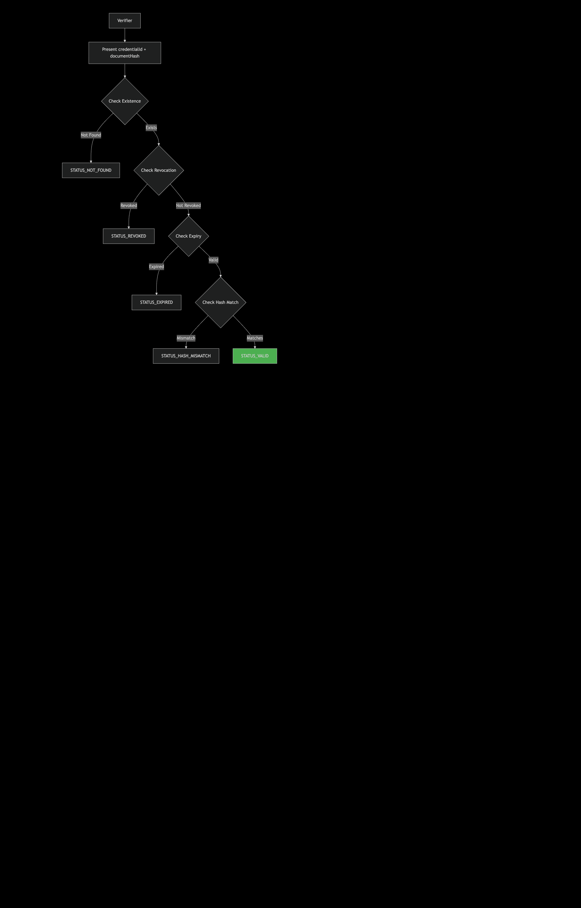

# CredentialRegistry Smart Contract

## 📋 Overview

`CredentialRegistry` is a Solidity smart contract that provides a decentralized, secure registry for verifiable credentials on the blockchain. It anchors credential hashes, IPFS CIDs, and Zero-Knowledge Proof (ZKP) Merkle roots with comprehensive metadata and lifecycle management.

## 🏗️ Architecture Overview


## 🎯 Key Features

- **🔐 Decentralized Identity Support**: DID-aware credential management
- **🔒 Cryptographic Security**: SHA-256 hash verification and ZKP Merkle roots
- **⚡ Gas Optimization**: Efficient storage with keccak256 hashing
- **🛡️ Security**: OpenZeppelin AccessControl, Pausable, and ReentrancyGuard
- **📊 Batch Operations**: Efficient bulk issuance and revocation
- **⏰ Lifecycle Management**: Expiry and revocation tracking
- **🔍 Verification Engine**: Comprehensive status checking

## 📊 Contract Flow


## 🏷️ Roles and Permissions


## 📝 Credential Structure

```solidity
struct Credential {
    bytes32 credentialHash;   // SHA-256 of canonical credential
    string ipfsCID;          // IPFS content address
    bytes32 merkleRoot;      // ZKP selective disclosure root
    address issuerAddress;   // On-chain issuer account
    string issuerDID;        // Issuer decentralized identity
    string holderDID;        // Holder decentralized identity
    uint256 timestamp;       // Issuance block timestamp
    uint256 expiry;          // Expiry timestamp (0 = never)
    bool revoked;            // Revocation status
    string revokedReason;    // Revocation reason
    uint256 revokedAt;       // Revocation timestamp
    bool exists;             // Existence sentinel
    string schema;           // Credential type/schema
}
```

## 🚀 Core Functions

### Issuance Flow


**Function**: `issueCertificate()`
- **Access**: `ISSUER_ROLE` only
- **Purpose**: Register new credential with full metadata
- **Key Parameters**:
  - `_credentialId`: Human-readable ID (e.g., "vc:trade-license:0001")
  - `_credentialHash`: SHA-256 hash of canonical credential bytes
  - `_ipfsCID`: IPFS content identifier for full document
  - `_merkleRoot`: ZKP Merkle root for selective disclosure
  - `_issuerDID`/`_holderDID`: Decentralized identifiers

### Verification Flow



**Function**: `verifyCertificate()`
- **Returns**: `(bool isValid, uint8 statusCode)`
- **Status Codes**:
  - `0` - ✅ **VALID**: Credential is authentic and active
  - `1` - ❌ **NOT_FOUND**: Credential ID doesn't exist
  - `2` - 🚫 **REVOKED**: Credential has been revoked
  - `3** - ⏰ **EXPIRED**: Credential has expired
  - `4` - 🔍 **HASH_MISMATCH**: Document hash doesn't match

### Revocation Flow

**Function**: `revokeCertificate()`
- **Access**: `ISSUER_ROLE` only
- **Purpose**: Permanently revoke a credential with reason
- **Metadata**: Stores revocation reason and timestamp

## 🔄 Batch Operations

### Batch Issuance
```solidity
function batchIssue(
    string[] calldata _credentialIds,
    bytes32[] calldata _credentialHashes,
    // ... other arrays
) external onlyRole(ISSUER_ROLE)
```
- **Gas Efficient**: Single transaction for multiple credentials
- **Validation**: All array lengths must match
- **Events**: Individual events emitted for each credential

### Batch Revocation
```solidity
function batchRevoke(
    string[] calldata _credentialIds, 
    string[] calldata _reasons
) external onlyRole(ISSUER_ROLE)
```
- **Use Case**: Bulk revocation during system updates or errors

## 🛡️ Security Features

### 1. **Access Control**
- Role-based permissions using OpenZeppelin `AccessControl`
- Separate roles for administration, issuance, and emergency pausing

### 2. **Reentrancy Protection**
- `ReentrancyGuard` prevents reentrancy attacks
- Critical functions are protected with `nonReentrant` modifier

### 3. **Emergency Stops**
- `Pausable` functionality for emergency contract suspension
- Only `PAUSER_ROLE` can pause/unpause

### 4. **Input Validation**
- Existence checks prevent overwriting existing credentials
- Array length validation in batch operations
- Revocation state validation

## 📊 Storage Optimization

### Gas-Efficient Design
- **Key Hashing**: `credentialId` stored as `keccak256(bytes(_credentialId))`
- **Packed Storage**: Efficient struct layout minimizes storage costs
- **Memory Usage**: View functions use `memory` for gas efficiency

## 🎪 Event System

### CredentialIssued
Emitted when new credentials are registered:
```solidity
event CredentialIssued(
    string indexed credentialId,      // Searchable by ID
    bytes32 indexed idHash,           // Searchable by hash
    address indexed issuerAddress,    // Searchable by issuer
    string issuerDID,
    string holderDID,
    string ipfsCID,
    bytes32 merkleRoot,
    uint256 timestamp,
    uint256 expiry,
    string schema
);
```

### CredentialRevoked
Emitted when credentials are revoked:
```solidity
event CredentialRevoked(
    string indexed credentialId,
    bytes32 indexed idHash,
    address indexed revoker,
    string reason,
    uint256 revokedAt
);
```

## 🔧 Management Functions

### Role Management
- `addIssuer(address)`: Grant issuance privileges
- `removeIssuer(address)`: Revoke issuance privileges

### Contract Management
- `pause()`: Emergency stop all write operations
- `unpause()`: Resume normal operations

## 💡 Use Cases

### 🏛️ Government Credentials
- Trade licenses, business permits, professional certifications
- Municipal authority issuance with DID identities

### 🎓 Educational Records
- Academic credentials, diplomas, certificates
- Selective disclosure of specific achievements

### 💼 Professional Certifications
- Industry certifications, skill badges
- Expiry-based automatic invalidation

## 🚨 Important Considerations

### Gas Costs
- **Issuance**: Moderate gas cost due to storage operations
- **Verification**: Low gas cost (view function)
- **Batch Operations**: Significant gas savings for bulk operations

### Storage Limitations
- String fields (DIDs, IPFS CIDs) have higher storage costs
- Consider off-chain storage with on-chain anchoring

### Upgradeability
- Current implementation is not upgradeable
- Consider proxy patterns for future upgrades

## 📋 Deployment

### Constructor
```solidity
constructor(address admin)
```
- Sets up initial roles
- Defaults to `msg.sender` if `admin` is `address(0)`

### Prerequisites
- Solidity ^0.8.19
- OpenZeppelin Contracts
- Compatible EVM network

## 🔍 Verification Examples

### Successful Verification
```javascript
// Credential exists, active, and hash matches
(isValid, statusCode) = await contract.verifyCertificate(
    "vc:trade-license:123", 
    documentHash
);
// Returns: (true, 0) - STATUS_VALID
```

### Failed Verification
```javascript
// Credential revoked
(isValid, statusCode) = await contract.verifyCertificate(
    "vc:revoked:456", 
    documentHash
);
// Returns: (false, 2) - STATUS_REVOKED
```

## 📞 Support

For technical support or security issues, please refer to the contract events and verification status codes for troubleshooting credential validation issues.

---

**License**: MIT  
**Security**: Production-ready with comprehensive access controls and emergency features  
**Audit**: Recommended for production deployment with third-party security audit